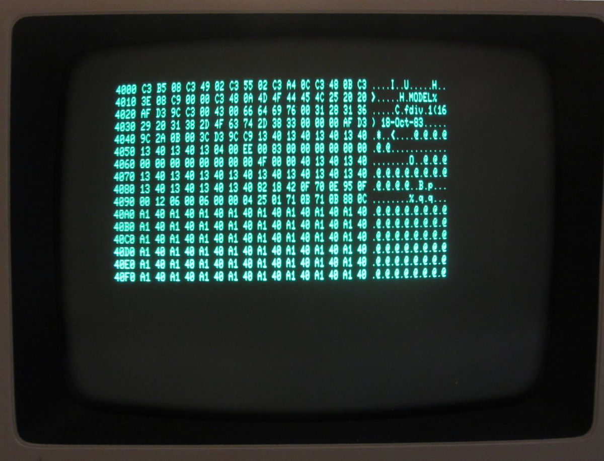

Serial fun with a Tandy TRS-80 Model 4P

The Model 4P has an option to boot from the serial port. The feature appears to be implemented to help testing boards at the factory. It is described in both the Technical Manual and the Service Manual. It it somewhat terse, but with some experimenting it is doable to create a program to make it work.

The option to initiate the serial boot is pressing Right-Shift during reset. What is not in the manual is that a floppy must be present in drive 0. 

The format used to transfer data over the serial port is "TRS-DOS Load Module Format (LMF)". This is also used for executable files, so if you extract a program from a disk and feed it to the serial boot service, it would run, assuming it doesn't require parts of DOS.

LMF uses two types of records, data records and control records. The data records transfer the data and may be up to 255 bytes long. The control record is used to pass the execution address, which is directly implemented. Therefore it is the last record of a transfer.

The current implementation is in Python 3. This is quite portable, and easy to understand. A real native executable is probably faster.

There are two programs:

inthex2lmf.py - converts hex-intel records to a hex presentation of LMF on stdout

Usage:
  python3 inthex2lmf.py <inputFile.hex> [< entryPoint >] >  <outputFile.lmf.txt
  
  The default entry point is the first address of the program.

serialService.py - initiates the serial transfer and sends the binary presentation of the hexFile to the Model 4P

Usage: 
  python3 serialService.py <lmfFile> [< ttyPort >]

A version of serialService that uses real LMF is being tested.

ASCII art fot the cable between Model 4P and a standard PC-serial port:

Transmit & reeceive lines between M4P and PC:

   	M4P                    PC            PC
    25-pin DIN             9-pin subDE   25-pin subDB  function
        7 -------------------- 5 ----------- 7 -        GND
        2 -------------------- 2 ----------- 3 -        M4P TxD, PC RxD
        3 -------------------- 3 ----------- 2 -        M4P RxD, PC TxD

Wiring M4P side:

     8 -+        CD
        |             loop
    20 -+        DTR

Wiring PC side:
    
                               7 +-          4 +-  RTS
                                 |             |             loop
                               5 +           5 +-  CTS

                               6 +-          6 +-  DSR
                                 |             |
                               1 +-          8 +-  CD        loop
                                 |             |
                               4 +-         20 +-  DTR

Notes:

* Loading data appears to be working reliable, but the control transfer is still a bit finicky
* The switch from 'Not Ready' to 'Ready' is now instantaneously, but could be controlled from the host side. Not sure this can be done platform/interface independent.
* This solution is developed and tested only on X64 Linux. It should work on different platforms too.

Below a photo of the screen after loading the updated SCRDUMP.lmf.txt. This newer one dumps 16 lines, not 10 and allows for some simple navigation ('<' and '>' keys).

